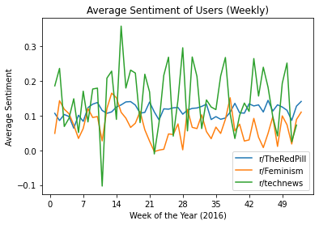
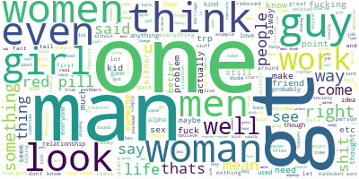
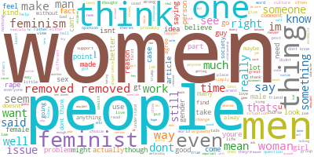
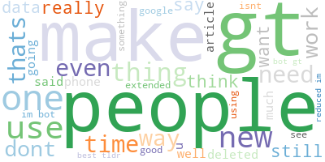

# Large-Scale Computing Final Project
Kaylah Thomas, Sruti Kanthan, and Angelica Bosko

### Research Topic

Tracking key topics and sentiment towards women during a 12-month
period on the subreddit r/TheRedPill. 

### Research Design 

Reddit spaces can house large communities where like-minded people are able to engage 
in discussion about relevant or interesting topics. On rare occasions, these communities can harbor prejudiced and violent opinions about groups of people. The particular reddit r/TheRedPill is a place where many users, particularly men, share an overwhelmingly negative sentiment about women. In our research,
we intend to analyze trends in discussion about women within the subreddit r/TheRedPill, as well as changes
in sentiment over time compared to subreddits with generally neutral or overwhelmingly positive discussion about women. This may offer some insight into how dangerous group think may have a negative impact on marginalized communities both online and offline.

### Corpus

In this project, we will be using text data gathered from the comment section 
of posts under the subreddit r/TheRedPill in 2016. In order to gather this text data,
we first use a database ([pushshift.io](https://files.pushshift.io/reddit/comments/)) containing all reddit data from a particular month in 2016 and filter only for the particular subreddit data we choose to examine. For our data collection, we will be looking at
r/TheRedPill, r/Feminism, and r/technews.
Each monthly raw database contains around 8GB of data.

## Using Large-Scale Computing Methods

### Data Collection

For our analysis, we wanted to use information from the comment section of three 
different subreddits in 2016: r/TheRedPill, r/Feminism, and r/technews. We used the 
subreddit r/TheRedPill to track the overall sentiment and topics discussed on the subreddit
month-by-month in 2016. We used the subreddit r/Feminism as a secondary source to understand 
sentiment and topics discussed in a subreddit with opposing ideology from r/TheRedPill. We also 
decided to use r/technews as a good "control" subreddit. We believe that r/technews should contain mostly
neutral sentiment, as opposed to the sentiment of either r/TheRedPill or r/Feminism.

In order to retrieve month-by-month comment data for each subreddit in 2016, we downloaded 12 files
containing all Reddit comments for one particular month. The 12 monthly files 
(located on https://files.pushshift.io/reddit/comments/), were then downloaded to our local 
machines, where we pre-process the data to only contain comment information and time information for 
comments in our target subreddits. Each monthly raw data file for 2016 ranged between 6GB of data and
8GB of data.

In the [data_collection.ipynb file](https://github.com/lsc4ss-s21/final-project-ask-lsc/blob/main/data_collection.ipynb),
we include information about how to parse data files from PushShift.io for selected subreddits using PyWren.
Due to the large data size of these files and hardware limitations, we were unable to successfully use PyWren and consequently, used our local computers in
order to pickle the necessary data. In the data_collection.ipynb file, we also included code in order to run
each of the raw data files locally. After successfully pickling each of the individual monthly files, 
we store all the comments into one corpus, which can be seen at the end of the notebook.

After pickling together all the individual files, the final file (comments_corpus_final.pickle)
was 182.6 MB in size. The joined pickle file is located on Google Drive at this link:

https://drive.google.com/drive/u/0/folders/1kgnMtWss9kZBtJvI6wyEao8vdLCnv48W

### Data Cleaning

In order to run both topic analysis and sentiment analysis, the data had to be cleaned appropriately.
We used Dask in orderto parallelize the data cleaning process. To use Dask appropriately, we
had to create a Dask Cluster with 6 m5.xlarge instances to properly handle the data size. 

In the [reddit_data_cleaning_dask.ipynb notebook] 
(https://github.com/lsc4ss-s21/final-project-ask-lsc/blob/main/reddit_data_cleaning_dask.ipynb),
we first installed the packages necessary to clean our files. The installation for these packages is as follows:
```{python}
! pip install nltk
! pip install spacy
! pip install dask
! pip install graphviz
! pip install dask[complete]
```
We then imported all of the necessary packages for data cleaning. The imported packages are as follows:
```{python}
import dask
import pickle
from collections import Counter
from nltk.corpus import stopwords
from nltk.stem.wordnet import WordNetLemmatizer
import string
import nltk
import pandas as pd
import spacy
import time
```
After importing the necessary packages, we also downloaded 'stopwords', 'wordnet', and 'punkt' for the 
data cleaning. When starting the cluster, we requested 8 workers with 1 core each and 4 GiB of memory.

The first function, clean_comments,  cleans the comments by getting rid of words and unnecessary spaces (\n). 
Our second function, remove_stopwords, removes all the stop words from the comments as provided in the 
nltk package. Our third function, lemmatize, sorts the words by grouping them by similarity.
Our fourth function, clean_text, runs all of these functions and stores the information in a dataframe.

After the fourth function, Dask runs the clean_text function in order to parallelize the cleaning process.
The final product, a dataframe, can be seen within the notebook.

Due to the size of the files, it is possible that the system may run out of memory. Therefore,
we created a separate [notebook](https://github.com/lsc4ss-s21/final-project-ask-lsc/blob/main/local_cleaning_sentiment%20(1).ipynb) containing code on running data cleaning on a local machine.
This code uses a similar approach to Dask, without using AWS.

### Word2Vec

Word2Vec is an algorithm used in natural language processing. Specifically, 
the algorithm uses neural networks to learn word associations using a large amount of text.
This algorithm fits perfectly with our corpus, seeing that we are using a large amount of data.
We also decided to use Word2Vec because this algorithm converts each distinct word into a vector. 
By converting each word into a vector, we are then able to conduct both sentiment analysis
and topic analysis on each comment in each target subreddit. 

### Sentiment Analysis

Sentiment analysis is a very useful and widely used natural language processing technique.
This natural language processing technique takes in text and detects either positive of negative
sentiment in the text. The polarity of the sentiment ranges on a scale from -1 to 1. In this project,
we use sentiment analysis on the comments from our target subreddits in order to better understand the 
true sentiment of each text. We also want to track sentiment over a 12-month period, gauging whether sentiment 
has gotten more or less negative over time. By understanding change in sentiment, we can better understand
dangerous group think and its threat on marginalized communities. 

To contextualize these trends, we performed collected sentiment analysis for the subreddits r/Feminism and r/technews.
The justification for these specific subreddits is to gather sentiment in discussion forums that contain neutral topics 
(r/technews) and a subreddit that is gebrally more uplifting and supportive towards women (r/Feminism). In order to create the model, the sentiment analysis scores 
were loaded into `Dask` and pandas methods were implemented on a dask dataframe.



### Topic Analysis

Topic analysis is similar to sentiment analysis, but focuses on the most frequent topics mentioned rather than the 
overall sentiment of a text. Topic analysis is a useful and widely used machine learning technique that allows
users to directly assign topics to text data. Topic analysis can use any unstructured form of text data and process the
information in order to analyze the most common topics of the text. In our project, we use topic 
analysis to better understand the main focus of our target subreddits. For example, we want to not only understand the 
sentiment behind the comments, but what the comments are most frequently about. For r/TheRedPill, we want to see whether
most of the negative sentiment is directed towards women and femininity.

In order to understand the top words used in each target subreddit, we decided to use
the package "wordcloud" using PyPI. In order to install the package, we used the following code:

```{python}
! pip install wordcloud
```

The wordcloud package takes the comment data and creates a nice visual representation of the data.
In the [reddit_word_cloud.ipynb notebook](https://github.com/lsc4ss-s21/final-project-ask-lsc/blob/main/reddit_word_cloud.ipynb), we separated the overall dataframe into three 
dataframes by subreddit (r/TheRedPill, r/Feminism, r/technews). After separating by subreddit,
we imported the wordcloud library and combined all of the text data in each subreddit into one long string.
After, we were able to use the package to generate wordcloud images and save them as png files.

Here, you can view the word cloud images for each subreddit:

r/TheRedPill:



r/Feminism:



r/technews:



For r/TheRedPill, we can see that the most frequent words are "one" and "man".
For r/Feminism, the most frequent words are "women" and "people".
For r/technews, the more frequent words are "people" and "make".

Overall, these word clouds allow us to understand more about the major topics discussed
in each subreddit.

## Notebook Workflow

1. [Data Collection](https://github.com/lsc4ss-s21/final-project-ask-lsc/blob/main/data_collection.ipynb) (PyWren/Local)
2. [Text Cleaning](https://github.com/lsc4ss-s21/final-project-ask-lsc/blob/main/reddit_data_cleaning_dask.ipynb) (Dask)
3. [Comment Tokenizing and Lemmatizing](https://github.com/lsc4ss-s21/final-project-ask-lsc/blob/main/reddit_get_lemmas_local.ipynb) (Local)
4. [Sentiment Analysis](https://github.com/lsc4ss-s21/final-project-ask-lsc/blob/main/vader_spark%20(1).ipynb) (PySpark)
5. [Temporal Trends](https://github.com/lsc4ss-s21/final-project-ask-lsc/blob/main/reddit_temporal_data_trends.ipynb) (Dask)
6. [Topic Analysis and Word Clouds](https://github.com/lsc4ss-s21/final-project-ask-lsc/blob/main/reddit_word_cloud.ipynb) (PySpark/Local)


## Works Cited

Raw Reddit Data Retrieved from Pushshift.io:

https://files.pushshift.io/reddit/comments/

How to extract subreddit data from raw Reddit data (pushshift.io):

https://github.com/AhmedSoli/Reddit-Politics/blob/master/01_Content_Analysis/PreProcessing/.ipynb_checkpoints/010_ExtractCommentsTextCorpus-checkpoint.ipynb

Information on Word2Vec:

https://en.wikipedia.org/wiki/Word2vec

Understanding Sentiment Analysis:

https://monkeylearn.com/sentiment-analysis/
